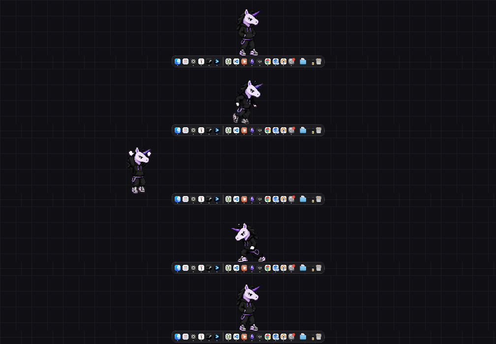
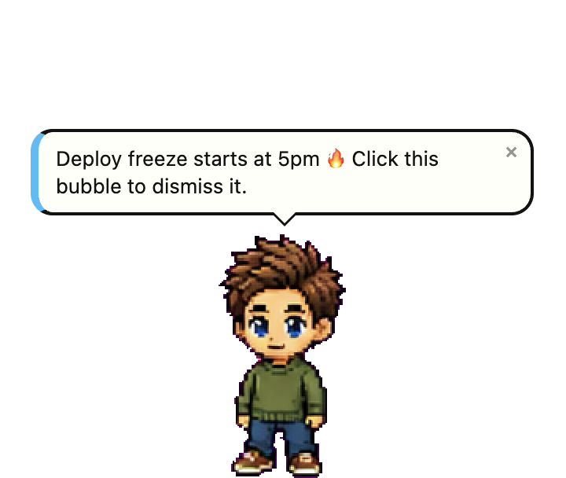
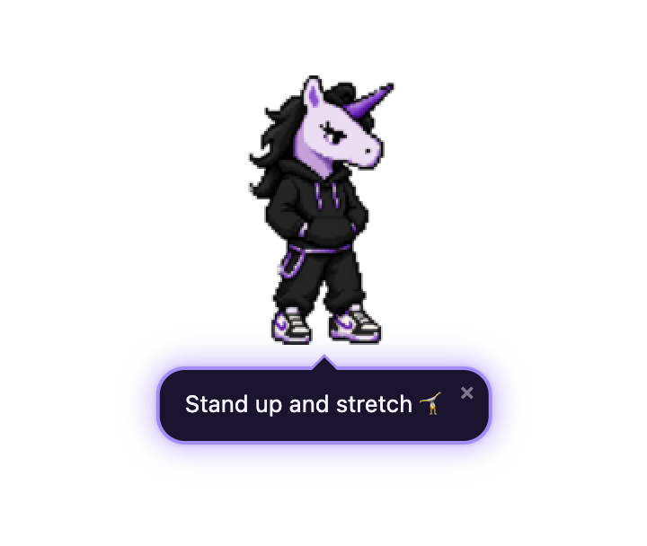
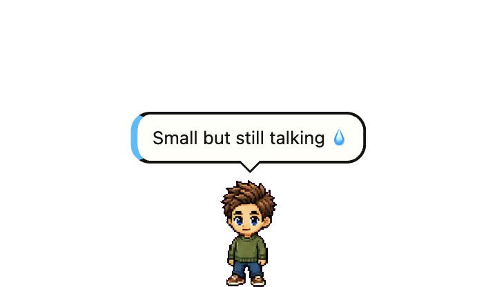
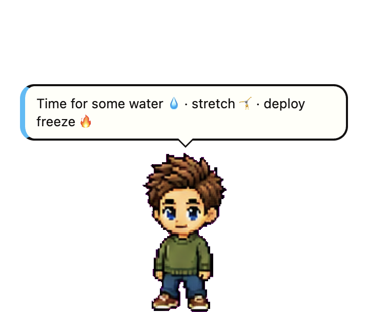
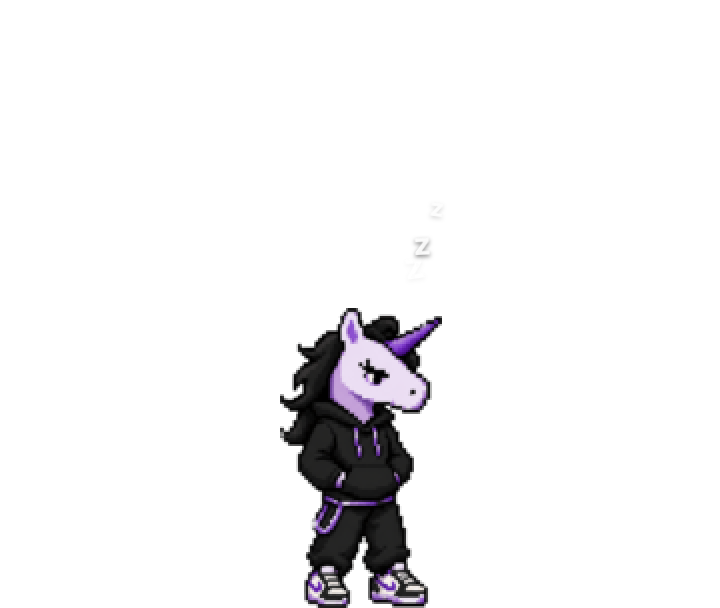

<div align="center">

# Keycode Pet

**A pixel character that lives on your desktop.** It runs along the bottom of your screen over
whatever you are working on, reminds you to drink water, and the whole team can make every installed
pet say something by editing one file.

[](https://github.com/doylefermi-kv/keycode-2026-mascot-pet/actions/workflows/ci.yml)
[](https://github.com/doylefermi-kv/keycode-2026-mascot-pet/releases/latest)
[](LICENSE)

**[Download for macOS, Windows or Linux →](https://github.com/doylefermi-kv/keycode-2026-mascot-pet/releases/latest)**



</div>

> [!IMPORTANT]
> **The app is not code-signed**, so macOS and Windows both warn you the first time you open it. On
> macOS, **right-click the app and choose Open** rather than double-clicking — you only do it once.
> [Full install instructions →](docs/INSTALL.md)

> **The character is a placeholder.** `pixel-coder` is a pixel-art chibi human, not the Keycode mascot.
> Swapping it is a file swap plus a JSON edit, with no code changes — see [docs/ASSETS.md](docs/ASSETS.md).

---

## What it does

<table>
<tr>
<td width="52%" valign="top">

**It talks.** The team publishes a message and every installed pet says it — once each, whenever that
machine next wakes up. A notification with no timeout waits until you click it, so an announcement
cannot be missed by looking away.

</td>
<td width="48%"></td>
</tr>
<tr>
<td width="52%" valign="top">

**Put it anywhere.** Drag it off the floor and it stays where you drop it, patrolling left and right at
that height — and it is still there after a restart. Drop it near the bottom and it re-locks to the
floor. Take it right to the very top and the speech bubble moves underneath it, because there is
nowhere above left to put one.

</td>
<td width="48%"></td>
</tr>
<tr>
<td width="52%" valign="top">

**Three sizes.** Right-click → Size. Only the sprite scales — bubble text stays readable at every size,
because a message you cannot read is not a message.

</td>
<td width="48%"></td>
</tr>
<tr>
<td width="52%" valign="top">

**Wellness reminders.** Water and stretch, at intervals you pick from the menu — each with its own
animation: the pet drinks from a bottle, or presses a pair of dumbbells overhead. They are wall-clock
deadlines rather than timers, so closing your laptop for two hours does not produce a backlog of four
reminders on wake.

</td>
<td width="48%"></td>
</tr>
<tr>
<td width="52%" valign="top">

**Turn movement off** and it settles down to sleep rather than freezing, then cycles quietly in place.
**Turn "Always on top" off** and it drops behind your windows entirely — though it still rises for as
long as it has something to say, because a message nobody can see has not been delivered.
Right-clicking the pet gives the same menu as the tray icon — which matters on Wayland, where the
compositor swallows right-clicks and the tray is the only way in.

</td>
<td width="48%"></td>
</tr>
</table>

---

## Sending a notification

Every installed pet polls one JSON file every minute. Publishing to it is how you reach everyone.

### From the browser — no checkout needed

**[Actions → Notify → Run workflow](https://github.com/doylefermi-kv/keycode-2026-mascot-pet/actions/workflows/notify.yml)**

Type the message, pick a tone and an expiry, run it. Every pet has it within about a minute. No clone,
no Node, no shell — which is the point: publishing should not be limited to whoever has the repo
checked out.

| Field | |
|---|---|
| **message** | What the pet says. Clamped to 200 characters. Emoji are fine. |
| **expires** | `30m`, `24h`, `7d`. Required — see below. |
| **tone** | `info` · `success` · `warning` · `error`. Colours the accent bar. |
| **priority** | `urgent` also raises a corner toast **and** displaces whatever is on screen. Keep it scarce or it stops meaning anything. |
| **animation** | What the pet does while it speaks. |
| **url** | Optional. Clicking the bubble opens it *and* dismisses it. |
| **duration** | Optional, `2s`–`30s`. **Leave it empty and the bubble waits to be clicked** — usually what you want. |

### From a terminal

```bash
pnpm notify "Keycode on Fire 🔥" --tone warning --animation jumping --expires 24h
pnpm notify:list                    # what is live, scheduled, expired
pnpm notify "…" --dry-run           # validate and print, change nothing
```

### Three rules that will bite you otherwise

**Ids are generated, and permanent.** Each message is shown *once per install, ever*, keyed by its id.
Reusing an id shows nothing at all to anyone who saw the first one — silently, while you see a
successful publish. So ids come from the text plus a timestamp; never write one by hand.

**An expiry is required.** Anything phrased relative to now — "starting in 15 minutes", "in 30 days" —
is wrong for whoever installs next week. Give it a window matching how long it stays true.

**Publishing is a commit.** The manifest lives in [`site/`](site/) and deploys to GitHub Pages, so a
message reaching everyone is a reviewable change rather than a side effect of someone's shell.

See [docs/BROADCAST.md](docs/BROADCAST.md) for the schema, every clamp with its number, the nine
fault-injection modes, and how release announcements work.

---

## Status

| | |
|---|---|
| **macOS** | Verified — transparency, always-on-top, motion, sizes, free placement, broadcast, and installing from a quarantined `.dmg`. |
| **Windows** | **Pixels now attempted**, for the first time: the harness takes a desktop-level composite screenshot (PowerShell `CopyFromScreen`) and asserts against it, which needs no alpha channel and so does not depend on `capturePage()` — that still stalls on the runner. Whether the runner's session yields a real frame is answered by the uploaded artifact on each release run. |
| **Linux** | Verified at the X server, not just in-process — `pnpm lab:linux` runs the app on a real X server in a container and screenshots the **root window**, which is the only way to see window shaping and real compositing. The pet, the whole speech bubble, the sleep overlay and click-through all check out. Unverified: the Wayland tray fallback, and **emoji render as tofu** ([an open bug](docs/VERIFICATION.md)). |

439 tests, no Electron required to run them. [docs/VERIFICATION.md](docs/VERIFICATION.md) is the honest
list of what is proven and what is not.

**No telemetry.** One network request — the manifest — and no analytics, identifiers or accounts. The
"Report a problem…" menu item copies a report and reveals the log for you to attach; nothing is ever
uploaded by the app itself.

---

## Building it

Requires Node ≥ 20 and pnpm.

```bash
pnpm install          # also fetches the Electron binary (~290MB)
pnpm build
pnpm dev
```

To watch it over a dark backdrop, which is how transparency bugs become visible:

```bash
KEYCODE_PET_BACKDROP=1 pnpm dev
```

### Commands

| | |
|---|---|
| `pnpm dev` | Run from source |
| `pnpm build` | Compile main (tsc) and the renderer (Vite) |
| `pnpm test` | 439 tests, no Electron required |
| `pnpm typecheck` | `tsc --noEmit` over both tsconfigs |
| `pnpm generate` | Regenerate everything derived from `pet/spritesheet.json` |
| `pnpm generate:check` | Fail if the committed generated files are stale |
| `pnpm smoke --name x --backdrop` | Launch, screenshot, assert pixels — see [docs/VERIFICATION.md](docs/VERIFICATION.md) |
| `pnpm smoke:states` | One screenshot per animation state |
| `pnpm lab:linux` | Run the pet on a real X server in a container and screenshot the root window. This is the only way to see Linux window shaping from a Mac — `capturePage()` cannot |
| `pnpm package` | macOS `.dmg` + `.zip`. **macOS only by design** — Windows and Linux come from CI |
| `pnpm notify "…"` | Publish a broadcast: validate, commit, push |
| `pnpm manifest:serve` | Local manifest server with fault injection |

### Environment variables

| Variable | Effect |
|---|---|
| `KEYCODE_PET_BACKDROP=1` | Show the opaque dark backdrop window. Dev only |
| `KEYCODE_PET_SMOKE=1` | Emit the JSONL harness handshake on stdout, accept commands on stdin |
| `KEYCODE_PET_FORCE_STATE=<state>` | Pin one animation state instead of running the motion engine |
| `KEYCODE_PET_MANIFEST_URL=<url>` | Override the broadcast manifest URL |
| `KEYCODE_PET_POLL_MINUTES=<n>` | Override the poll interval, clamped to 1–1440 |
| `KEYCODE_PET_ALLOW_INSECURE_MANIFEST=1` | Permit `http://` to loopback **only**, and only in an unpackaged build |
| `KEYCODE_PET_OZONE=native` | Opt back into native Wayland on Linux, accepting a pet that cannot move |

---

## How it is put together

Two seams carry the whole design. [ARCHITECTURE.md](ARCHITECTURE.md) has the detail; the short version:

**Main owns truth; the renderer is a dumb view.** One validated object flows main → renderer, one
boolean flows back. The renderer sets attributes, sets `textContent`, hit-tests against a generated
alpha mask, and decides nothing. A test greps it for timers, `fetch` and `innerHTML`, because that rule
only survives if something checks.

**The motion engine is pure.** `advance(state, input) => state`, with the clock and the randomness
injected. Ten minutes of pet life simulates headlessly in about 90ms, deterministically — which matters
because the liveliness logic has the subtlest bugs and they are only visible after minutes of watching.

Everything about the sprite — row offsets, frame counts, durations, state names, the alpha mask, the
tray icon — is generated from `pet/spritesheet.json`. Nobody types `-208px` by hand.

```
apps/desktop/src/
  main/        the impure half: windows, tray, menus, timers, IO
  motion/      pure: advance(), the run planner, seeded RNG
  callouts/    pure: the arbiter, text sanitising
  reminders/   pure: wall-clock deadline rules
  broadcast/   the manifest: URL guard, capped fetch, schema, poller
  updates/     version compare, update service
  renderer/    two dumb views (pet, toast) and their CSS
  preload/     two narrow contextBridge bridges
pet/           the art and its animation map — the single source of truth
site/          what GitHub Pages serves: the manifest and the landing page
scripts/       generators, the smoke harness, notify, the dev manifest server
```

Runtime dependencies: **`zod`**. That is the whole list.

## Commits, tags and versions

**Commits** are [Conventional Commits](https://www.conventionalcommits.org/) with a scope naming the
directory the change lives in — `feat(motion):`, `fix(broadcast):`, `build(package):`, `docs:` — and a
lowercase imperative subject.

**Tags** are annotated, never lightweight, so `git tag -n1` reads as a changelog. `v0.0.0`–`v0.8.0` mark
the nine build milestones; `v1.0.0` marks all of them green; from `v1.1.0` they are releases.

**The version in `package.json` matches the tag** — both files. Not cosmetic: `app.getVersion()` reads
it, and the update check compares the manifest's `latestVersion` against it. A stale `0.0.0` is what
made every install think a phantom `0.6.0` was available.

> Known artefact: `v0.8.0` is an *ancestor* of `v0.7.0`. M8 (the update check) was built before M7
> (packaging), because packaging last means packaging everything. The tags name milestones, not a
> release sequence, and reordering them would misreport when the work landed.

## Documentation

| | |
|---|---|
| [docs/INSTALL.md](docs/INSTALL.md) | Installing, including what each unsigned-app warning looks like |
| [docs/BROADCAST.md](docs/BROADCAST.md) | Manifest schema, every limit, how to publish |
| [ARCHITECTURE.md](ARCHITECTURE.md) | The seams, the two clocks, and what would break at scale |
| [docs/VERIFICATION.md](docs/VERIFICATION.md) | The screenshot loop, and **what is not verified** |
| [DECISIONS.md](DECISIONS.md) | Every deviation from the brief, the issue, or openpets — with reasons |
| [docs/ASSETS.md](docs/ASSETS.md) | Swapping the art with no code changes |
| [docs/PROMPT.md](docs/PROMPT.md) | The implementation brief this was built from, errors corrected in place |
| [SECURITY.md](SECURITY.md) | Reporting a vulnerability |
| [THIRD-PARTY-NOTICES.md](THIRD-PARTY-NOTICES.md) | openpets (MIT), Noto Color Emoji (OFL 1.1 / Apache-2.0) |

## License

[MIT](LICENSE) © KeyValue Software Systems. Platform workarounds were learned from **openpets** (MIT) —
see [THIRD-PARTY-NOTICES.md](THIRD-PARTY-NOTICES.md).
